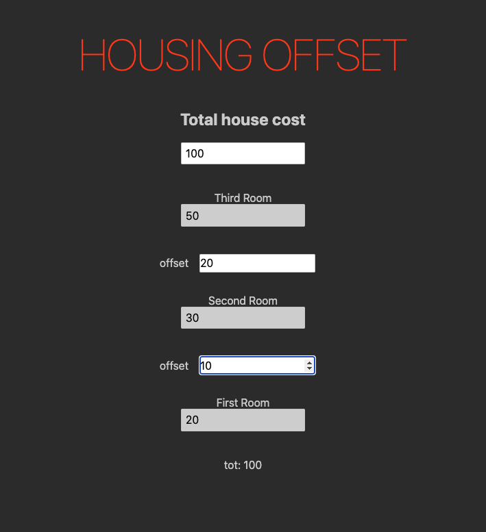

# Housing Offset

Calculate the price of each room using offsets (from how much more you'd pay for each room).  

## Why is the styling weird and couldn't you make the number of rooms dynamic?

Yes, but I am going to view a house in 10 mins and thought now is the perfect time to create my first Svelte app.  
Maybe a task for a less busy day.  

